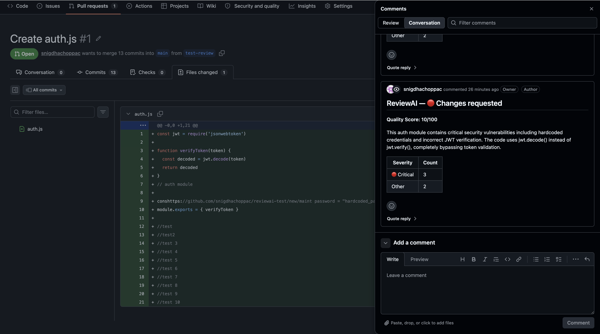
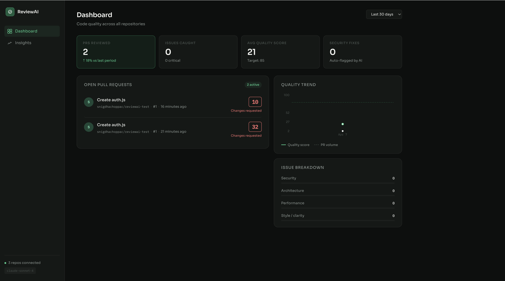

<p>
  <a href="https://reviewai-dashboard.vercel.app">Live Demo</a> •
  <a href="https://github.com/snigdhachoppac/reviewai">Code</a>
</p>
## Demo





> Intelligent pull request reviews powered by Claude. Goes beyond linting to understand context, flag security vulnerabilities, suggest architectural improvements, and track code quality over time.

---

## What it does

ReviewAI installs as a GitHub App and automatically reviews every pull request. It posts inline comments directly in the GitHub PR interface — just like a human reviewer would — but responds in seconds rather than hours.

**It catches things linters can't:**
- JWT signature bypass vulnerabilities and other auth flaws
- N+1 query patterns inferred from ORM usage
- Architectural anti-patterns like god objects and layer violations
- Unhandled promise rejections and race conditions
- Hardcoded secrets and insecure defaults

Every review includes a **quality score (0–100)** and a summary. The dashboard lets engineering leads track trends over time and spot recurring problems across the team.

---

## Architecture

```
GitHub PR opened/updated
        │
        ▼
  GitHub App Webhook  (Express + @octokit/app)
        │
        ▼
  BullMQ Job Queue    (async, retryable, Redis-backed)
        │
        ▼
  AI Review Engine
  ├── Fetch PR diff via GitHub API
  ├── Load recent issue history from Postgres (context)
  ├── Build structured prompt → Claude claude-sonnet-4
  ├── Parse + validate JSON response (Zod)
  └── Post inline comments + Check Run to GitHub
        │
        ▼
  Postgres (reviews + comments)
        │
        ▼
  React Dashboard  (metrics, PR list, insights)
```

---

## Project structure

```
reviewai/
├── github-app/              # Node.js backend
│   ├── src/
│   │   ├── index.js         # Express server entry point
│   │   ├── webhooks/
│   │   │   └── handler.js   # GitHub webhook listener
│   │   ├── review/
│   │   │   ├── engine.js    # Core review orchestration
│   │   │   ├── prompt.js    # Prompt builder (context-aware)
│   │   │   ├── parser.js    # Zod-validated JSON parser
│   │   │   ├── queue.js     # BullMQ worker setup
│   │   │   └── router.js    # Dashboard metrics API
│   │   └── lib/
│   │       └── db.js        # Postgres pool + migrations
│   ├── .env.example
│   └── Dockerfile
│
├── dashboard/               # React frontend
│   ├── src/
│   │   ├── pages/
│   │   │   ├── Dashboard.jsx   # Metrics overview
│   │   │   ├── PRDetail.jsx    # Full review with comments
│   │   │   └── Insights.jsx    # Recurring patterns + trends
│   │   ├── components/
│   │   │   ├── Sidebar.jsx
│   │   │   ├── MetricCard.jsx
│   │   │   ├── PRList.jsx
│   │   │   ├── TrendChart.jsx
│   │   │   └── IssueBreakdown.jsx
│   │   └── hooks/
│   │       └── useApi.js    # Data fetching hooks + mock data
│   ├── nginx.conf
│   └── Dockerfile
│
└── docker-compose.yml       # Full local stack
```

---

## Getting started

### Prerequisites

- Node.js 20+
- Docker + Docker Compose (for Postgres & Redis)
- An Anthropic API key — [get one here](https://console.anthropic.com)
- A GitHub account to register the App

### 1. Clone and install

```bash
git clone https://github.com/yourusername/reviewai.git
cd reviewai
npm install
```

### 2. Register a GitHub App

1. Go to **GitHub → Settings → Developer settings → GitHub Apps → New GitHub App**
2. Set the webhook URL to your server (use [smee.io](https://smee.io) for local development)
3. Set permissions:
   - **Pull requests**: Read & Write
   - **Checks**: Read & Write
   - **Contents**: Read
4. Subscribe to events: `Pull request`
5. Generate and download the private key

### 3. Configure environment

```bash
cp github-app/.env.example github-app/.env
# Fill in all values in .env
```

Key variables:

| Variable | Description |
|---|---|
| `GITHUB_APP_ID` | Your GitHub App's numeric ID |
| `GITHUB_PRIVATE_KEY` | Contents of the downloaded `.pem` file |
| `GITHUB_WEBHOOK_SECRET` | Secret you set when registering the app |
| `ANTHROPIC_API_KEY` | Your Anthropic API key |
| `DATABASE_URL` | Postgres connection string |
| `REDIS_URL` | Redis connection string |

### 4. Start infrastructure

```bash
docker-compose up postgres redis -d
```

### 5. Run the app

```bash
# Terminal 1 — backend
cd github-app && npm run dev

# Terminal 2 — dashboard
cd dashboard && npm run dev
```

Dashboard: [http://localhost:3000](http://localhost:3000)  
API: [http://localhost:3001](http://localhost:3001)

For local webhook testing, use [smee.io](https://smee.io):

```bash
npx smee-client --url https://smee.io/your-channel --target http://localhost:3001/api/webhook
```

### 6. Install the app on a repo

Go to your GitHub App's settings page → **Install App** → choose a repo. Open a PR and ReviewAI will start reviewing automatically.

---

## How the AI review works

The prompt sent to Claude includes:

1. **PR title and description** — so the model understands intent
2. **Full diff** (up to 15 files sorted by change size)
3. **Recent issues in touched files** — loaded from Postgres, so the model knows if a file has been repeatedly problematic
4. **Repository language breakdown** — for language-specific advice

Claude returns structured JSON:

```json
{
  "overallScore": 54,
  "summary": "This PR introduces a critical authentication vulnerability...",
  "comments": [
    {
      "filePath": "src/auth/jwt.js",
      "line": 42,
      "category": "security",
      "severity": "critical",
      "title": "jwt.decode() skips signature verification",
      "suggestion": "Replace with jwt.verify()...",
      "codeExample": "const decoded = jwt.verify(token, process.env.JWT_SECRET);",
      "references": ["CVE-2022-21449"]
    }
  ]
}
```

The response is validated with Zod before being posted to GitHub, so malformed AI output never crashes the worker.

---

## Scoring

| Deduction | Amount |
|---|---|
| Critical issue | −20 pts |
| Warning | −8 pts |
| Info / suggestion | −2 pts |

PRs with a score ≥ 85 and ≤ 2 comments get auto-approved. PRs with any critical issue trigger a "Request changes" review event.

---

## Dashboard features

- **Overview metrics** — total reviews, issues caught, avg quality score, security fixes
- **Quality trend** — 14/30/90-day sparkline of average scores
- **PR queue** — live list of reviewed PRs with scores and severity tags
- **PR detail** — full comment list with suggested code fixes
- **Insights** — recurring patterns, AI-generated team recommendations

---

## Extending ReviewAI

**Add more VCS providers** — The review engine (`engine.js`) is decoupled from the GitHub webhook handler. Implement a GitLab or Bitbucket webhook listener that calls `runReview()` with the same job data shape.

**Fine-tune on your codebase** — Export your `review_comments` table as training data and fine-tune a model on your team's actual accepted/rejected suggestions for higher relevance.

**Slack notifications** — Add a BullMQ completion handler that posts a Slack message when a critical issue is found.

**PR template enforcement** — Extend the prompt to check that PR descriptions match your team's template and flag missing fields.

---

## Tech stack

| Layer | Technology |
|---|---|
| GitHub integration | `@octokit/app`, `@octokit/webhooks` |
| AI | Anthropic Claude claude-sonnet-4 |
| Queue | BullMQ + Redis |
| Database | PostgreSQL |
| Backend | Node.js + Express |
| Frontend | React + Vite + Recharts |
| Validation | Zod |
| Containers | Docker + Docker Compose |

---

## License

MIT

---

## Multi-VCS support

ReviewAI supports both **GitHub** and **GitLab** out of the box, with a clean provider abstraction that makes adding Bitbucket or Azure DevOps straightforward.

| Feature | GitHub | GitLab |
|---|---|---|
| Webhook events | `pull_request.opened/synchronize` | `Merge Request Hook` |
| Inline comments | PR Review API | MR Discussion API (with fallback to notes) |
| Status checks | GitHub Checks API | GitLab Commit Statuses |
| Auth | GitHub App (installation tokens) | Project access token |

The core review engine (`src/review/engine.js`) is fully provider-agnostic — it calls `vcs.getFiles()`, `vcs.postReview()`, etc. Adding a new provider means implementing one file (`src/vcs/yourprovider.js`) and registering it in `src/vcs/factory.js`.

### GitLab setup

1. Go to your GitLab project → **Settings → Webhooks**
2. Set URL to `https://your-server.com/api/webhook/gitlab`
3. Set secret token (same as `GITLAB_WEBHOOK_SECRET` in `.env`)
4. Enable: **Merge request events**
5. Add `GITLAB_TOKEN` (project access token with `api` scope) to `.env`

---

## Fine-tuning pipeline

The `finetune/` directory contains a complete pipeline for training a domain-specific code review model on real PR data from public repositories.

### Why this matters

Off-the-shelf LLMs are great generalists. Fine-tuning on 10,000+ real, accepted code review comments from high-quality open source projects (Rails, React, Linux kernel) teaches the model:

- The tone of senior engineers: precise, terse, non-patronising
- When **not** to comment (trivial nits, formatting)
- Domain-specific patterns: framework idioms, security anti-patterns by language
- Your team's own historical preferences (after enough data accumulates)

### Pipeline

```
Stage 1: collect.js  — Scrape merged PRs, extract review comments with author ack signals
Stage 2: filter.js   — Multi-dimensional quality scoring (specificity, actionability, signal)
Stage 3: format.js   — Convert to chat prompt/completion pairs + train/eval split
Stage 4: train.py    — LoRA fine-tune CodeLlama-7B on a single A100 GPU (~3 hrs, ~$15)
Stage 5: eval.js     — Benchmark fine-tuned vs base model: JSON validity, specificity, category accuracy
```

### LoRA: what it is and why it's used

LoRA (Low-Rank Adaptation) freezes the base model's 7 billion parameters and injects small trainable matrices (< 1% of parameters) into the attention layers. The result:

- Fine-tuning takes 3 hours on one A100 instead of days on a cluster
- The trained adapter is ~50MB instead of 14GB
- The base model's knowledge is preserved — only the style and domain focus changes

```bash
# Full pipeline in 4 commands
node finetune/scripts/collect.js --repos rails/rails,facebook/react --output finetune/data/raw.jsonl
node finetune/scripts/filter.js  --input finetune/data/raw.jsonl --output finetune/data/filtered.jsonl
node finetune/scripts/format.js  --input finetune/data/filtered.jsonl --output finetune/data/train.jsonl
python finetune/scripts/train.py --base-model codellama/CodeLlama-7b-Instruct-hf \
  --train-data finetune/data/train.jsonl --output-dir finetune/models/reviewai-v1
```
